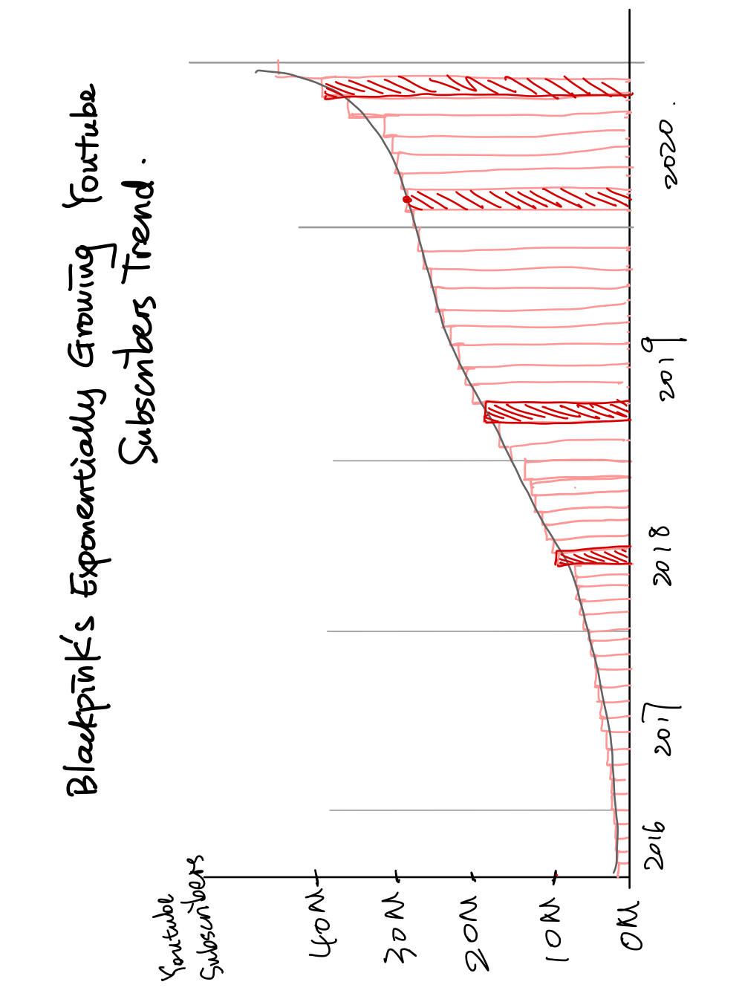
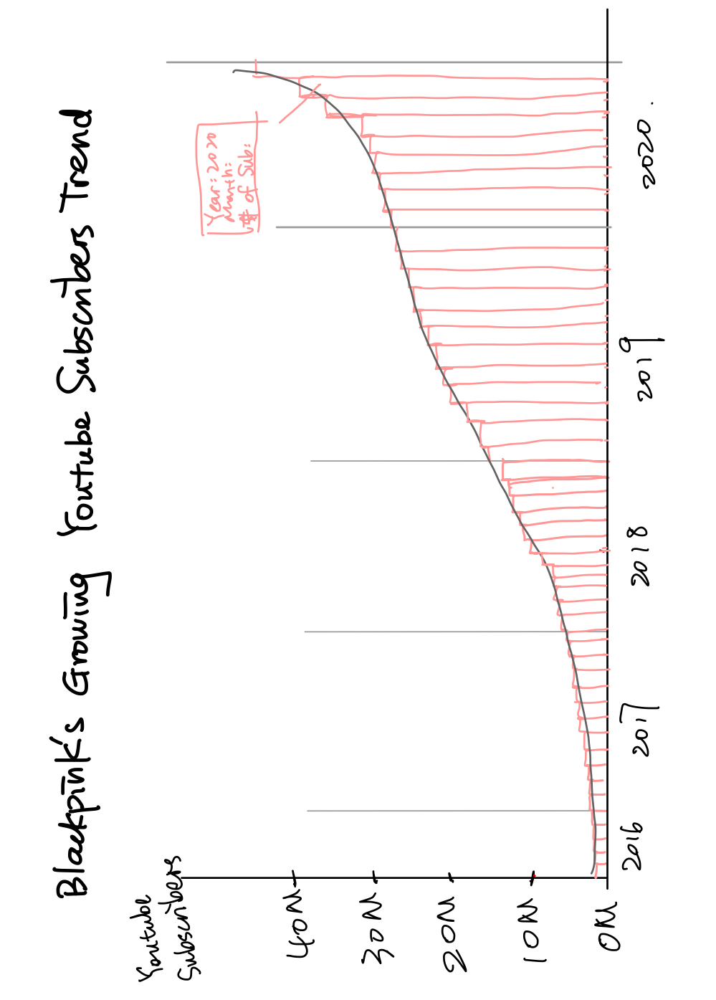

# BLACKPINK YouTube Subscribers

## The Original Visualization

<noscript></noscript><object class='tableauViz'  style='display:none;'><param name='host_url' value='https%3A%2F%2Fpublic.tableau.com%2F' /> <param name='embed_code_version' value='3' /> <param name='path' value='shared&#47;PGRQMMWQC' /> <param name='toolbar' value='yes' /><param name='static_image' value='https:&#47;&#47;public.tableau.com&#47;static&#47;images&#47;PG&#47;PGRQMMWQC&#47;1.png' /> <param name='animate_transition' value='yes' /><param name='display_static_image' value='yes' /><param name='display_spinner' value='yes' /><param name='display_overlay' value='yes' /><param name='display_count' value='yes' /><param name='language' value='en-US' /></object>
                

## Critiques
#### Describe your overall observations about the data visualization here. What stood out to you? What did you find worked really well? What didn't? What, if anything, would you do differently?  

The visualization is pretty informative and having the information it indicates in the title and the outside context. It shows the growing number of YouTube followers of BLACKPINK channel since the registration date to September 2020. The visualization has all the things which should be there to make the visualization understandable. 

However, the design of this bar chart  makes it difficult for audience to grasp the information quickly. It complicates the plot. For example, the colorful bars and its legends show the month of the year, however it also has the x labels indicate the month of that year on x axis as well. This information is redundant. Also, the theme of this plot does not get along with the topic and the context. It has a mellow yellow as background color, which kind of pops out from the black and pink topic theme.  

#### Who is the *primary audience* for this tool? Do you think this visualization is effective for reaching that audience? Why or why not?

The primary audience of this tool is people who loves KPOP or the fans of BLACKPINK as well as KPOP entertainment agencies who wants to know the data and statistics of the popularity of BLACKPINK, since the number of YouTube follower is a very informative symbol of popularity. 

I feel this visualization is not super effective for reaching the audience, because it purely presents the data instead of telling stories with it. The design of this visualization makes it seem to be separate from the "BLACKPINK" topic/theme, which will for sure be less attractive for fans of BLACKPINK (I'm a big fan of them so I can say this ^^). 

In addition, as a fan of BLACKPINK, I not only want to know the growing trend of the number of YouTube followers, but also when they reached 10k, 20k, 30,k 40k followers as they broke many records in the YouTube platform. This will give fans some historical information about how they grow and link these timelines with the events they were having at those time.

#### Are there measures you feel are missing or not being captured here? What would you change? Provide 1-2 recommendations (color, type of visualization, layout, etc.)

I think the measures which are important here are the color theme and proper annotations or reference lines. These will help the visualization provide some consistency in better telling a story about BLACKPINK, as well as leading audiences to learn more about the topic. 

I recommend that the visualization should be changed to black and pink theme, and only use these two colors to present the data in a more intuitive and consistent way. 

Also, I suggest that some annotations should be added to some bars where they break the records of 20k, 30k, 40k followers. Probably annotating all of these values will yield too many captions and information on the plot, so I probably will only choose 40k followers as the point of annotation. In addition, adding a trend line will show some reference for their future development as well. I believe these will provide fans an idea of their growing trend and specifically when they become internationally popular. 

## Revise Process and Sketch
I revised the visualization following the steps below:

1. *Colorful bars*. For the bars, their colors are presenting redundant information. The color legend and x-axis are causing too much eye travel for useless innformation. For the sake of making the plot neat and reduce viewer's eye travel, I chose only to use pink as the main color with gradient change to plot the number of YouTube follower bars. In addition, the month value is not super informative and useful in presenting the whole picture of the growing trend of BLACKPINK YouTube followers. So I decided to get rid of the multiple colors and also x-axis labels which indicate the month of the year so that to make the plot simpler to view. 

2. *Worksheet color theme*. Since I picked pink for the bar color, I decided to change the worksheet background to black (actually dark grey), so that the visualization gets along well with the 'black' and 'pink' topic theme. This will attract BLACKPINK's fans to view the data since the original colorful theme is poping out too much and does not fit with the focus on BLACKPINK.

3. *Reference line*. I added a trend line to the visualization because I think the audience wants to know the overall trend of how they grow their followers and the trend of their increasing popularity. The trend line also can shed some light on the future development of BLACKPINK, which is exactly what the fans of BLACKPINK want to know.  

4. *Highlight*. I highlighted the bars where Blackpink reached 10k, 20k, 30k, 40k followers. These will give audience the specific timelines about when they broke these records that they are the first KPOP female group who attracted these amount of YouTube followers in the shortest amount of time. This will also lead the audience to link these timelines with the events which were happening during that specific time. For example, the time they reached 10k followers were right after they released their most popular song in the whole KPOP history "DDU-DU DDU-DU".   
 
5. *Title*. A nice title could give audience a heads-up about what to expect in the visualization. So I changed the title of this data visualization to *BLACKPINK's Exponentially Growing YouTube Subscribers*.

As a result, you can view the first sketch I made here. 

## Test the Solutions

- Student A, early 20's

**Describe to me what this is telling you**: This is about the number of BLACKPINK YouTube subscribers. The growing number of their subscribers. And also, the time of when they achieve these amount of followers. It's pretty clear.

**Aything you find surprising or confusing**: I don't quite understand the highlighted bar. Why you highlight the bars? 

**The intended audience for this**: Probably Blackpink fans? Or people who love KPOP I guess. I'm not quite into this data visualization. I don't listen to their songs that much. But they are popular, and I just know them. 

**Anything you would change or do differently**: Probably change the title I guess. I don't really see the "expoentially growing" trend here. Or maybe because the data is only limited to 2020?

- Student B, mid 20's

**Describe to me what this is telling you**: BLACKPINK's social media impact! I love them and they are so popular on YouTube. The growing numbers of their subscribers. It's better if you can have the data till now, cuz they just reached 80k subscribers recently and it's unbelieveable!

**Aything you find surprising or confusing**: It's all clear to me. I mean the first time I saw it I'm wondering why you highlighted these bars, but after I clicked it and see the detailed info I understand you are showing the time they reached 10k, 20k, 30k, and 40k subscribers.

**The intended audience for this**: People like me and you! We all love BLACKPINK and want to see their social media impact and their popularity. They are the most famous KPOP female group in the world and this made me so proud!

**Anything you would change or do differently**: Not really, but probably the background color? It will be better in black, you know. (I will set it to black later - From me). Oh cool! Then I think it is all clear. 

## Final Redesign

I interviewed with two different people and they gave super helpful feedbacks. Based on their feedbacks, I decided to make further changes on my previous sketch. 

1. *Annotation*. I decided not to highlight bars, but instead add annotation to the bar where they reached or exceeded 40k followers. I initially want to annotate the bars when they reached 10k, 20k, 30k, and 40k subscribers. But too many captions will make the visualization too messy. Since the visualization is interactive, so I decided only to annotate the most recent record when they reached 40k YouTube subscribers. 

3. *Title*. The previous title is not consistent with what the data is showing. Due to the limited data constraint, I cannot show the whole picture of their exponentially growing YouTube subscribers till today. For the data we have here, there is no obvious pattern what the number of subscribers are growping exponentially. So, the title should be consistent with the data. 

Based on the sketch and the feedbacks, I made the final redesign of this visualization.

The final sketch for the visualization: 

*The final visualization made by Tableau.*

<noscript></noscript><object class='tableauViz'  style='display:none;'><param name='host_url' value='https%3A%2F%2Fpublic.tableau.com%2F' /> <param name='embed_code_version' value='3' /> <param name='site_root' value='' /><param name='name' value='Blackpinkyoutubefollowertrend&#47;subscribers' /><param name='tabs' value='no' /><param name='toolbar' value='yes' /><param name='static_image' value='https:&#47;&#47;public.tableau.com&#47;static&#47;images&#47;Bl&#47;Blackpinkyoutubefollowertrend&#47;subscribers&#47;1.png' /> <param name='animate_transition' value='yes' /><param name='display_static_image' value='yes' /><param name='display_spinner' value='yes' /><param name='display_overlay' value='yes' /><param name='display_count' value='yes' /><param name='language' value='en-US' /></object>
                

