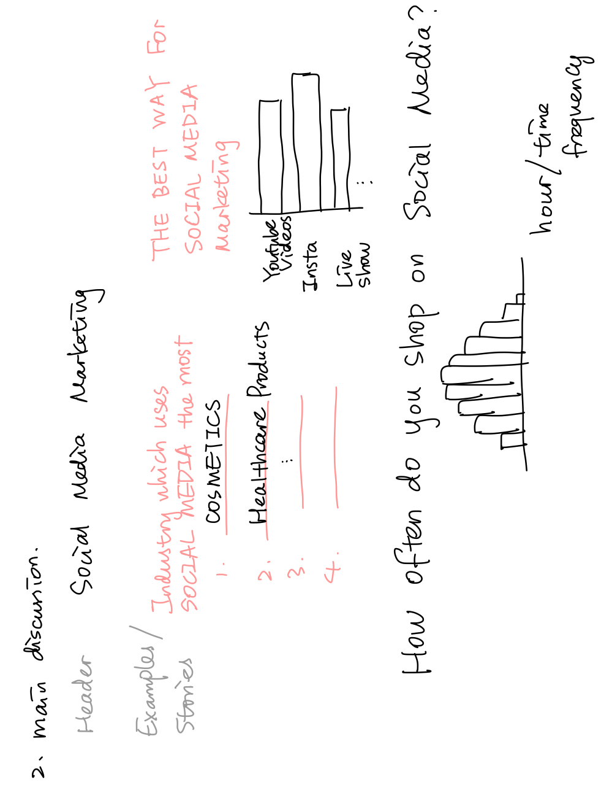

# Outline
### Summary
As millenials, we spent a lot of time surfing on social media like Instagram, Twitter, Youtube, Facebook.... Countless social media platforms "control" or "cost" our 
life. 
Social media is too broad to talk about. So, I picked one part of this broad topic which is social media marketing about how commercials utilize social media to 
promote their products, and sell them to us through influencers on these social media. I want to develop a full-scope of story, starting from analyzing the general impact
of social media on Millenials, and then directing to the specific topic of the social media marketing. 

### Project Structure
The project will be structured in the according way. 

1. Introduction. 
Introduce the audience (Millenials) to the context of how they spend their time on social media, their attitude towards social media, their usage of social media and etc.

2. Main Discussion. 
Transition from the introduction, highlight part of the usage of social media is actually targeted on online shopping. Give some examples about some of the most popular social media influencers.

3. Ask for an answer. 
"What is your attitude towards social media marketing?" And give visualization around data from already-done survey.

4. Conclusion/Suggestions. 
From user perspective, how to manage the time spent on social media, the money spent on social media. From commercial perspective, how to utilize social media to create a healthy purchasing enviroment towards consumers.

# Initial Sketches

# Datasets
- Datasets used for the introduction
1. [data of usage of social media by students between age 17-22](https://data.world/maheepmahat/data-of-usage-of-social-media-by-students-between-age-17-22) 
2. [Top University Social Media Rankings](https://data.world/nicole-klassen/top-university-social-media-rankings-2021/workspace/file?filename=University+Social+Media+Rankings.xlsx)
3. [Which Social Media Millennials Care About Most](https://data.world/ahalps/which-social-media-millennials-care-about-most)

- Datasets used for the main discussion about the social media shopping and marketing
1. [Social Media Influence on Shopping](https://data.world/ahalps/social-influence-on-shopping)
2. [Social Media Usage Statistics and Ads Revenue](https://sproutsocial.com/insights/social-media-statistics/)

- Datasets used for asking for an answer section
4. [Online Influencer Marketing](https://data.world/ahalps/online-influencer-marketing)

# Method and Medium
In order to complete this project, I will use **Shorthand** to put up a personal website. Along with it, I will embedded visualizations from **Tableau** or **Flourish** as well as HTML plugins to add more the main discussion content and interactive experience with the user. Also, I will use Unsplash to add consistent topic photos in my personal website. I will explore more on word/character font and style for my personal website. 
