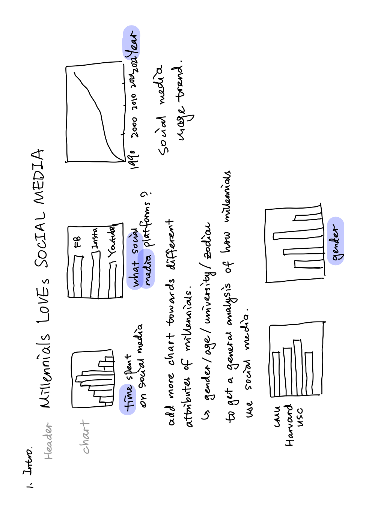
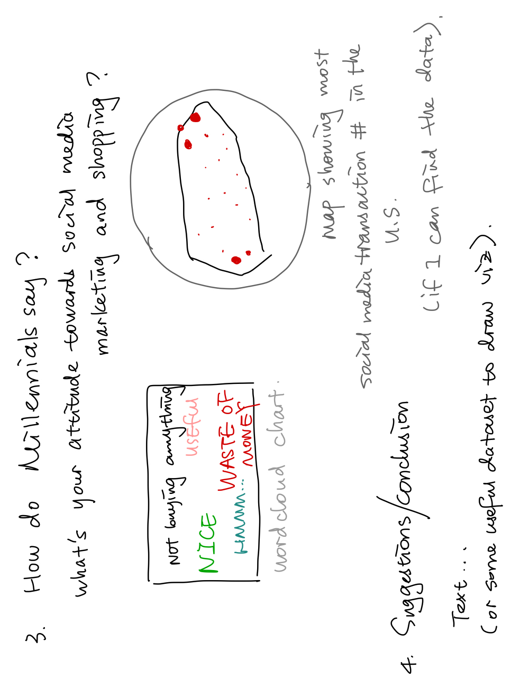

# Outline
### Summary
As Millennials, we spent a lot of time surfing on social media like Instagram, Twitter, Youtube, Facebook.... From a commercial perspective, social media provides a new convenient opportunity to help brands promote their products and pull potential consumer closer to the real product experience before purchasing through videos, photos and etc. 
 
Social media is a very broad topic. In order to narrow down the scope of the project, I decided to put more attention to the interesting topic, social media marketing or influencer marketing. This is about how commercials utilize social media and influencers to promote their products, and sell them to social media users. I want to develop a comprehensive story, starting from analyzing the general impact of social media on Millennials, and then directing to the specific topic of the social media marketing as well as some social media marketing strategies from a commercial perspective. 

### Project Structure
The project will be structured in the according way. 

1. Introduction. 
Introduce the audience (brands who want to promote their products) to the context of how Millennials spend their time on social media, their attitudes like gender, age, education level etc., their usage of social media and etc.

2. Main Discussion. 
Transition from the introduction, give the data that Millennials spend a lot of time shopping on Social Media and highlight the fact that social media helped a lot of companies to grow. Give some examples about some of the most popular social media influencers, the industries/companies who used the social media marketing the most and some interesting news/videos around the topic.

3. Dive Deeper.
Given the survey data around the question "What is Millennials' attitude towards social media marketing?", I will generate word cloud visualization, geographic visualizations to show how Millennials' opinions about social media marketing, in order to provide some insight about soical media marketing strategies.

4. Conclusion/Suggestions. 
Give suggestions on how companies and brands can use social media to create business opportunities and identify some potential challenges as well. 

# Initial Sketches

# Datasets
- Datasets used for the introduction
1. [data of usage of social media by students between age 17-22](https://data.world/maheepmahat/data-of-usage-of-social-media-by-students-between-age-17-22) 
2. [Top University Social Media Rankings](https://data.world/nicole-klassen/top-university-social-media-rankings-2021/workspace/file?filename=University+Social+Media+Rankings.xlsx)
3. [Which Social Media Millennials Care About Most](https://data.world/ahalps/which-social-media-millennials-care-about-most)

- Datasets used for the main discussion about the social media shopping and marketing
1. [Social Media Influence on Shopping](https://data.world/ahalps/social-influence-on-shopping)
2. [Social Media Usage Statistics and Ads Revenue](https://sproutsocial.com/insights/social-media-statistics/)

- Datasets used for asking for an answer section
4. [Online Influencer Marketing](https://data.world/ahalps/online-influencer-marketing)

# Method and Medium

In order to complete this project, I will use **Shorthand** to put up a personal website. Along with it, I will embedded visualizations from **Tableau** or **Flourish** as well as HTML plugins to add more the main discussion content and interactive experience with the user. 

For additional information, I will use Unsplash to add relative topic photos on my personal website. I will explore more on word/character font and style for my personal website as well. Following the copy right rule, I probably will also use some public videos or blogs to support my story telling.

# Critique Summary

1. Pick a side (done). Previously, I wasn't clear about the perspective or scope of this project. I vaguely put all the info and data I collected about social media without specifying which side I choose to develop my story and call to actions. Now I've revised this important part to only focus on commercial and companies.
2. Take out some unneccsarry plots/visualizations to keep the information concise and relevant. I will be more selective for the next step and only keep relevant plots and information.
3. Add more flows to connect the whole story. Probably the info or content I present here are still not well connected together to present a whole story. I will do more research on this topic and see what other data or information I can find to support forming a complete story. 
